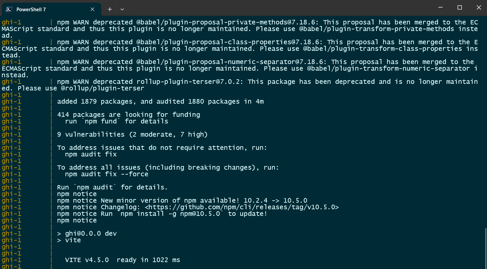

# Instructions for testing app

## Directions to start app:

1. docker volume create postgres-data
2. docker-compose build
3. docker-compose up

## To see api endpoints in browser:

http://localhost:8000/docs

## Main Page

http://localhost:5173/gamenight

When running the app for the 1st time after pulling changes for the Tailwind/Flowbite install, it may take several minutes to download.
This screenshot is the verification that the GHI container has finished installing Tailwind, Flowbite, and all their dependancies.

## Front-End Development

To use Flowbite components, navigate to https://flowbite.com/docs/components/sidebar/
